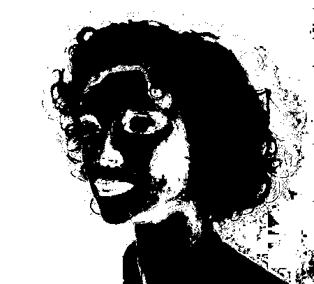

[ecu]: https://documents.uow.edu.au/~phung/download.html "ECU download page"
[hgr]: http://sun.aei.polsl.pl/~mkawulok/gestures/ "HGR download page"
[schmugge]: https://www.researchgate.net/publication/ "Schmugge download page"
[pratheepan]: http://cs-chan.com/downloads_skin_dataset.html "Pratheepan download page"
[abd]: https://github.com/MRE-Lab-UMD/abd-skin-segmentation "abd-skin download page"
[vpu]: http://www-vpu.eps.uam.es/publications/SkinDetDM/#dataset "VPU download page"
[uchile]: http://web.archive.org/web/20070707151628/http://agami.die.uchile.cl/skindiff/ "UChile download page"

# Skin Statistical
Detecting human skin using probability.

This skin detector uses three-dimensional histograms to model the data and probability calculus to perform the classification.

# Outcomes
Input         							|  Output
:-------------------------:|:-------------------------:
  |  
  |  

>Skin detection: input images from [Pratheepan](http://cs-chan.com/downloads_skin_dataset.html) skin dataset, and detected skin pixels using the ECU model

As can be seen in the second row, a probabilistic approach may have issues predicting on materials with skin-like colors, and on skin color values not featured in the training dataset, which may be a result of lighting.

# Skin detection algorithm
	1. First of all, read all the actual images with their corresponding mask pictures.
	2. Then for every (r, g, b) combination, calculated how many times this particular combination occurs as skin pixel and non_skin pixel.
	We identified non_skin pixel when the (r<150, g<150, b<150), otherwise skin
	3. Calculated probabiity for every distinct pixel.
		Lets say, for a rgb combination like 10, 20, 30
		It occurs as skin pixel 5 times and non skill pixel as 3 times.
			so, skin = 5
				non_skin = 3;

		Now probability of being skin pixel of that particluar rgb combination is (skin) / (skin + non_skin)
	
	4. Now for testing, select an unknown image. Read all the pixels of that image.
	5. If a particular rgb combinations probability of being skin is greater than a certain threshold(we assume it 0.555555)
	then consider that combination as skin pixel otherwise non_skin pixel. 

# How to use
1. Create the folder `dataset` and unzip into it the included databases in `dataset_importfiles` or add yours  
1. (optional) Prepare skin datasets:  
`python prepare_dataset.py <db-name>`
1. (optional) Modify dataset splits by modifying the `data.csv` file present in the dataset root folder
1. **Train** a model:  
`python train.py  <db-name>`
1. **Predict** over a dataset with  
`python predict.py <db-model> <db-predict>`  
Example: use Schmugge model to print predictions on ECU test set  
`python predict.py Schmugge ECU`
1. (optional) Test metrics:  
`python metrics.py <db-model> [db-predict]`  
If the db-predict is not specified, the metrics are measured on db-model itself

Already prepared datasets: `ECU, HGR_small, Schmugge`  
To add more datasets, modify the if/else chain at the end of `prepare_dataset.py` and use the same dataset format as the
supported ones.  
Scripts to include other common skin datasets are provided and most of them should work, but they have not been tested.  
  
Some pre-trained models are provided in the `models` folder. To use a model, unzip it from the folder and place it in the root directory of the project.

# Public datasets supported

ECU [1]: 3998 pictures, mostly face and half-body shots. [Download (ask the authors)][ecu]  
HGR [2]: 1558 hand gesture
    images. [Download][hgr]  
Schmugge [3]: 845 images, mostly face shots. [Download][schmugge]  
Pratheepan [4]: 78 pictures randomly sampled from the web. [Download][pratheepan]  
abd-skin [5]: 1400 abdominal pictures. [Download][abd]  
VPU [6]: 285 human activity recognition images. [Download][vpu]  
UChile [7]: 101 images obtained from the web and digitized news videos. [Download][uchile]  

## Bibliography
1. >   Phung, S., Bouzerdoum, A., & Chai, D. (2005). Skin segmentation using color pixel
    classification: analysis and comparison. IEEE Transactions on Pattern Analysis
    and Machine Intelligence, 27(1), 148-154.
    https://doi.org/10.1109/tpami.2005.17  
1. > Kawulok, M., Kawulok, J., Nalepa, J., & Smolka, B. (2014). Self-adaptive algorithm for
    segmenting skin regions. EURASIP Journal on Advances in Signal Processing, 2014(1).
    https://doi.org/10.1186/1687-6180-2014-170  
1. > Schmugge, S. J., Jayaram, S., Shin, M. C., & Tsap, L. V. (2007). Objective evaluation of
    approaches of skin detection using ROC analysis. Computer Vision and Image Understanding,
    108(1-2), 41-51.
    https://doi.org/10.1016/j.cviu.2006.10.009
1. > Tan, W. R., Chan, C. S., Yogarajah, P., & Condell, J. (2012). A Fusion Approach for
    Efficient Human Skin Detection. IEEE Transactions on Industrial Informatics, 8(1), 138-147.
    https://doi.org/10.1109/tii.2011.2172451
1. > Topiwala, A., Al-Zogbi, L., Fleiter, T., & Krieger, A. (2019). Adaptation and Evaluation
    of Deep Learning Techniques for Skin Segmentation on Novel Abdominal Dataset.
    2019 IEEE 19th International Conference on Bioinformatics and Bioengineering (BIBE).
    https://doi.org/10.1109/bibe.2019.00141
1. > SanMiguel, J. C., & Suja, S. (2013). Skin detection by dual maximization of
    detectors agreement for video monitoring. Pattern Recognition Letters, 34(16),
    2102-2109.
    https://doi.org/10.1016/j.patrec.2013.07.016
1. > J. Ruiz-del-Solar and R. Verschae. “SKINDIFF-Robust and fast skin segmentation”.
    Department of Electrical Engineering, Universidad de Chile, 2006.

# Credits

Credits to the original version author: 
https://github.com/Chinmoy007/Skin-detection
