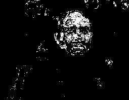

# Skin Statistical
Detecting human skin using probability.

# Outcomes
Input         							|  Output
:-------------------------:|:-------------------------:
  |  

# Skin detection algorithm
	1. First of all, read all the actual images with their corresponding mask pictures.
	2. Then for every (r, g, b) combination, calculated how many times this particular combination occurs as skin pixel and non_skin pixel.
	We identified non_skin pixel when the (r<150, g<150, b<150), otherwise skin
	3. Calculated probabiity for every distinct pixel.
		Lets say, for a rgb combination like 10, 20, 30
		It occurs as skin pixel 5 times and non skill pixel as 3 times.
			so, skin = 5
				non_skin = 3;

		Now probability of being skin pixel of that particluar rgb combination is (skin) / (skin + non_skin)
	
	4. Now for testing, select an unknown image. Read all the pixels of that image.
	5. If a particular rgb combinations probability of being skin is greater than a certain threshold(we assume it 0.555555)
	then consider that combination as skin pixel otherwise non_skin pixel. 

# How to use
1. Create the folder `dataset` and unzip into it the included databases in `dataset_importfiles` or add yours  
1. (optional) Prepare skin datasets:  
`python prepare_dataset.py <db-name>`
1. (optional) Modify dataset splits by modifying the `data.csv` file present in the dataset root folder
1. **Train** a model:  
`python train.py  <db-name>`
1. **Predict** over a dataset with  
`python predict.py <db-model> <db-predict>`  
Example: use Schmugge model to print predictions on ECU test set  
`python predict.py Schmugge ECU`
1. (optional) Test metrics:  
`python metrics.py <db-model> [db-predict]`  
If the db-predict is not specified, the metrics are measured on db-model itself

Already prepared datasets: `ECU, HGR_small, Schmugge`  
To add more datasets, modify the if/else chain at the end of `prepare_dataset.py` and use the same dataset format as the
supported ones.  
Scripts to include other common skin datasets are provided and most of them should work, but they have not been tested.  
  
Some pre-trained models are provided in the `models` folder. To use a model, unzip it from the folder and place it in the root directory of the project.

# Public datasets used
**ECU**: https://documents.uow.edu.au/~phung/download.html (ask the authors)  
**HGR**: http://sun.aei.polsl.pl/~mkawulok/gestures/  
**Schmugge**: https://www.researchgate.net/publication/257620282_skin_image_Data_set_with_ground_truth

# Credits

Credits to the original version author: 
https://github.com/Chinmoy007/Skin-detection
