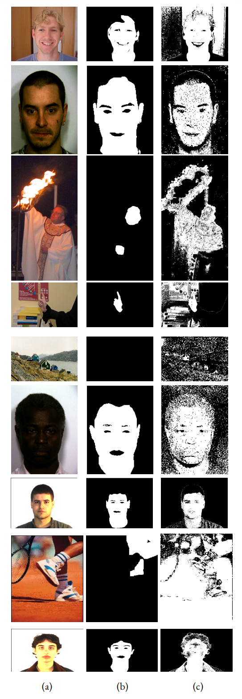

[ecu]: https://documents.uow.edu.au/~phung/download.html "ECU download page"
[hgr]: http://sun.aei.polsl.pl/~mkawulok/gestures/ "HGR download page"
[schmugge]: https://www.researchgate.net/publication/257620282_skin_image_Data_set_with_ground_truth "Schmugge download page"
[pratheepan]: http://cs-chan.com/downloads_skin_dataset.html "Pratheepan download page"
[abd]: https://github.com/MRE-Lab-UMD/abd-skin-segmentation "abd-skin download page"
[vpu]: http://www-vpu.eps.uam.es/publications/SkinDetDM/#dataset "VPU download page"
[uchile]: http://web.archive.org/web/20070707151628/http://agami.die.uchile.cl/skindiff/ "UChile download page"

[thesis]: https://github.com/123mpozzi/skin-detection-thesis "Human Skin Detection In Color Images"
# Skin Statistical
Detecting human skin using probability.  
This work is part of my [Bachelor thesis][thesis].

The skin detector uses three-dimensional histograms to model the data and probability calculus to perform the classification.

#### Credits
Credits to the author of the original version: 
https://github.com/Chinmoy007/Skin-detection


## Outcomes

<div align="center">
    
    <br>
    Significant outcomes: (a) the input image; (b) the ground truth; (c) detected skin pixels.<br>
    Input images are from ECU, HGR, and Schmugge datasets.
    Various models have been used to detect skin pixels.
</div>
<br>

These are some significant outcomes (hence not representative; for the skin detector performance see [Performance](#Performance))
that shows how well the skin detector performs given the right training dataset,
but also its limitations.  
Skin Detection is a challenging task because of materials with skin-like colors (wood, copper, leather, clay),
conditions that modify an image appearance (lighting, camera color science, motion blur),
and the wide range of skin tones that the human skin may assume.  

The first, third, and the last three rows represent some of the challenges described.  
The detector calculates the probability of a given color to be a skin pixel, so it has no capability of seeing feature patterns in images, hence it can misclassify images with no skin pixels if there are pixels with skin-like color, such as in the fifth row.

An in-depth analysis of outcomes can be seen in the thesis.


<a name="Performance"></a>
## Performance

The metrics are calculated as follows.  
Initially, the metrics are measured for all the instances, then the average and population standard
deviation for each metric are computed.

Again, an in-depth analysis of performance can be seen in the thesis.

#### Performance on single databases
For each dataset: the skin detector is trained on the training set, and then predictions are performed on the test set.  
For example, with ECU as the dataset, it means that the skin detector is trained using the training set of ECU, and then tested on the test set of ECU.

|             | ECU | HGR | Schmugge |
| ---:            | :---:              | :---:  | :---: |
| F<sub>1</sub> ↑       | 0.6980 ± 0.22 | 0.9000 ± 0.15 | 0.5098 ± 0.39 |
| IoU ↑                 | 0.5751 ± 0.23 | 0.8434 ± 0.19 | 0.4303 ± 0.34 |
| D<sub>prs</sub> ↓     | 0.4226 ± 0.27 | 0.1524 ± 0.19 | 0.7120 ± 0.54 |

#### Performance across databases
For each dataset: the skin detector is trained on the training set, and then predictions are performed on all the images of every other datasets.  
For example, with ECU as the training dataset and HGR as the testing dataset, it means
that the skin detector is trained using the training set of ECU, and then tested on all the HGR
dataset.  
The expression “HGR on ECU”
describes the situation in which the evaluation is performed by using HGR as the training set and ECU as the test set.

|             | ECU_on_HGR | ECU_on_Schmugge | HGR_on_ECU | HGR_on_Schmugge | Schmugge_on_ECU | Schmugge_on_HGR |
| ---: | :---: | :---: | :---: | :---: | :---: | :---: |
| F<sub>1</sub> ↑       | 0.5577 ± 0.29 | 0.3319 ± 0.28 | 0.4279 ± 0.19 | 0.4000 ± 0.32 | 0.4638 ± 0.23 | 0.5060 ± 0.25 |
| IoU ↑                 | 0.4393 ± 0.27 | 0.2346 ± 0.21 | 0.2929 ± 0.17 | 0.2981 ± 0.24 | 0.3318 ± 0.20 | 0.3752 ± 0.22 |
| D<sub>prs</sub> ↓     | 0.5701 ± 0.29 | 1.0477 ± 0.35 | 0.8830 ± 0.23 | 1.0219 ± 0.42 | 0.7542 ± 0.30 | 0.6523 ± 0.27 |
| F<sub>1</sub> - IoU ↓ | 0.1184 | 0.0973 | 0.1350 | 0.1019 | 0.1320 | 0.1308 |

#### Performance on single skin tones
The methodology is the same as of 'Performance on single databases', but skin tones datasets are involved instead.

|             | DARK | MEDIUM | LIGHT
| ---:            | :---:              | :---:  | :---: |
| F<sub>1</sub> ↑       | 0.8123 ± 0.02 | 0.7634 ± 0.19 | 0.8001 ± 0.15 |
| IoU ↑                 | 0.6844 ± 0.03 | 0.6432 ± 0.17 | 0.6870 ± 0.16 |
| D<sub>prs</sub> ↓     | 0.3406 ± 0.05 | 0.3452 ± 0.23 | 0.3054 ± 0.20 |

#### Performance across skin tones
The methodology is the same as of 'Performance across databases', but skin tones datasets are involved instead.

|             | DARK_on_MEDIUM | DARK_on_LIGHT | MEDIUM_on_DARK | MEDIUM_on_LIGHT | LIGHT_on_DARK | LIGHT_on_MEDIUM |
| ---: | :---: | :---: | :---: | :---: | :---: | :---: |
| F<sub>1</sub> ↑       | 0.7928 ± 0.11 | 0.7577 ± 0.12 | 0.5628 ± 0.14 | 0.7032 ± 0.14 | 0.5293 ± 0.20 | 0.7853 ± 0.11 |
| IoU ↑                 | 0.6668 ± 0.11 | 0.6229 ± 0.13 | 0.4042 ± 0.13 | 0.5571 ± 0.14 | 0.3852 ± 0.19 | 0.6574 ± 0.12 |
| D<sub>prs</sub> ↓     | 0.3481 ± 0.16 | 0.4679 ± 0.18 | 0.6802 ± 0.20 | 0.5376 ± 0.23 | 0.6361 ± 0.22 | 0.3199 ± 0.16 |
| F<sub>1</sub> - IoU ↓ | 0.1260 | 0.1348 | 0.1586 | 0.1461 | 0.1441 | 0.1279 |

#### Inference time

Measured inference time: `0.371515 ± 0.002` seconds.  
Methodology is explained in the thesis.

The inference time has slightly improved with respect to the thesis by 
creating the prediction image looping on a sequence object (given by Pillow) instead of
every pixel.


## Skin detection algorithm

#### Training

1. Read all the actual images with their corresponding mask pictures
2. Construct two 3D histogram models of 256 bins: for every (R,G,B) combination, count how many times that particular combination occurs as `skin` pixel and `non_skin` pixel
3. Calculate probability for every distinct pixel.  
    Lets say, for a RGB combination like `R=10, G=20, B=30`, it occurs as skin pixel 5 times and non skin pixel as 3 times, so:  
    `skin = 5`  
    `non_skin = 3`  
    Probability of being skin pixel for that particular RGB combination is `skin / (skin + non_skin)`  
    `probability(10,20,30) = 5 / (5+3) = 0.625`  
4. Save the data to a CSV file, with rows in the format: `R,G,B,probabilityRGB`

#### Predicting

1. Read all the actual images with their corresponding mask pictures
2. Read the model CSV file
3. Select an image and read all its pixels
4. If a particular RGB combinations probability of being skin is greater than a certain threshold (we assume it 0.555555) then consider that combination as skin pixel otherwise non_skin pixel


## Usage

#### Setup

Datasets: place downloaded datasets inside the `dataset` folder in the project root directory (eg. dataset/Schmugge).  
>More information on this process can be read in the next section

Models: pre-trained models are provided into the `models` folder; to use a model, unzip it.  

Datasets splits: pre-defined dataset splits featured in the thesis are provided into the `dataset` folder; to use a pre-defined file, unzip it to its dataset's directory (eg. place `HGR_data.csv` into `dataset/HGR_small`).  


Once added, datasets need processing to create a CSV file representing their images, masks, and splits:  
```bash
cd code
python main.py reset -d <db-name>
```

#### Train a model  
```bash
python main.py train  -d <db-name>
```

#### Predict

Over a dataset  
```bash
python main.py single -m <db-model> -p <db-predict>

# eg. use Schmugge model to print predictions on ECU test set:  
python main.py single -m Schmugge -p ECU  
```
In batch mode on target datasets  
```bash
# Target an arbitrary number of datasets with -t <db-name>
python main.py batch -m base -t <db1> -t <db2> -t <db3>  
python main.py batch -m cross -t <db1> -t <db2>  
```

Using multiprocessing  
```bash
python main.py singlem -m <db-model> -p <db-predict>  
python main.py batchm -m cross -t <db1> -t <db2> -t <db3>  
```

On an image which has no groundtruth  
```bash
python main.py image -m <db-model> -p <path-to-image-to-predict>  

# eg. predict on documentation image using ECU model:  
python main.py image -m ECU -p ../docs/x/st-vincent-actor-album-art.jpg  
```

#### Measure inference time  
```bash
python main.py bench  
```

#### Measure metrics  
```bash
python main.py eval -p <path-to-predictions-dir>  

# eg. measure metrics of model 'light' on dataset 'medium':  
python main.py eval -p ../predictions/light_on_medium  
```

#### See commands usage
```bash
python main.py --help  
python main.py train --help  
```


## Public datasets supported

To import a dataset, place it into the `dataset` folder and rename its root directory to match its name from the list above. For HGR, the downscaled versions of HGR2A and HGR2B are used, so it is referred to as HGR_small in the program, and so must be its folder.

Datasets are not needed to perform predictions on a random image, models are enough (see command `python main.py image` in the previous section).

| Name            |  Description                                               | Download |
| ---:            | :---:                                                      | :---: |
| ECU [1]         | 3998 pictures, mostly face and half-body shots             | [Download (ask the authors)][ecu] |
| HGR [2]         | 1558 hand gesture images                                   | [Download][hgr] |
| Schmugge [3]    | 845 images, mostly face shots                              | [Download][schmugge] |
| Pratheepan [4]  | 78 pictures randomly sampled from the web                  | [Download][pratheepan] |
| abd [5]         | 1400 abdominal pictures                                    | [Download][abd] |
| VPU [6]         | 285 human activity recognition images                      | [Download][vpu] |
| UChile [7]      | 101 images obtained from the web and digitized news videos | [Download][uchile] |


| Ref   | Publication |
| :---  | :--- |
| 1     | Phung, S., Bouzerdoum, A., & Chai, D. (2005). Skin segmentation using color pixel classification: analysis and comparison. IEEE Transactions on Pattern Analysis and Machine Intelligence, 27(1), 148-154. https://doi.org/10.1109/tpami.2005.17  |
| 2 | Kawulok, M., Kawulok, J., Nalepa, J., & Smolka, B. (2014). Self-adaptive algorithm for segmenting skin regions. EURASIP Journal on Advances in Signal Processing, 2014(1). https://doi.org/10.1186/1687-6180-2014-170 |
| 3 | Schmugge, S. J., Jayaram, S., Shin, M. C., & Tsap, L. V. (2007). Objective evaluation of approaches of skin detection using ROC analysis. Computer Vision and Image Understanding, 108(1-2), 41-51. https://doi.org/10.1016/j.cviu.2006.10.009 |
| 4 | Tan, W. R., Chan, C. S., Yogarajah, P., & Condell, J. (2012). A Fusion Approach for Efficient Human Skin Detection. IEEE Transactions on Industrial Informatics, 8(1), 138-147. https://doi.org/10.1109/tii.2011.2172451 |
| 5 | Topiwala, A., Al-Zogbi, L., Fleiter, T., & Krieger, A. (2019). Adaptation and Evaluation of Deep Learning Techniques for Skin Segmentation on Novel Abdominal Dataset. 2019 IEEE 19th International Conference on Bioinformatics and Bioengineering (BIBE). https://doi.org/10.1109/bibe.2019.00141 |
| 6 | SanMiguel, J. C., & Suja, S. (2013). Skin detection by dual maximization of detectors agreement for video monitoring. Pattern Recognition Letters, 34(16), 2102-2109. https://doi.org/10.1016/j.patrec.2013.07.016 |
| 7 | J. Ruiz-del-Solar and R. Verschae. “SKINDIFF-Robust and fast skin segmentation”. Department of Electrical Engineering, Universidad de Chile, 2006. |
