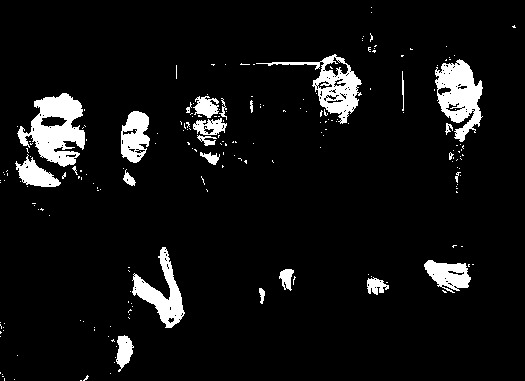
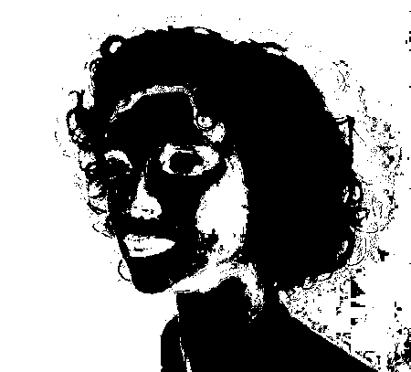

[ecu]: https://documents.uow.edu.au/~phung/download.html "ECU download page"
[hgr]: http://sun.aei.polsl.pl/~mkawulok/gestures/ "HGR download page"
[schmugge]: https://www.researchgate.net/publication/257620282_skin_image_Data_set_with_ground_truth "Schmugge download page"
[pratheepan]: http://cs-chan.com/downloads_skin_dataset.html "Pratheepan download page"
[abd]: https://github.com/MRE-Lab-UMD/abd-skin-segmentation "abd-skin download page"
[vpu]: http://www-vpu.eps.uam.es/publications/SkinDetDM/#dataset "VPU download page"
[uchile]: http://web.archive.org/web/20070707151628/http://agami.die.uchile.cl/skindiff/ "UChile download page"

# Skin Statistical
Detecting human skin using probability.

This skin detector uses three-dimensional histograms to model the data and probability calculus to perform the classification.

# Outcomes
Input         							|  Output
:-------------------------:|:-------------------------:
  |  
  |  

>Skin detection: input images from [Pratheepan](http://cs-chan.com/downloads_skin_dataset.html) skin dataset, and detected skin pixels using the ECU model

As can be seen in the second row, a probabilistic approach may have issues predicting on materials with skin-like colors, and on skin color values not featured in the training dataset, which may be a result of lighting.

# Skin detection algorithm

## Training

1. Read all the actual images with their corresponding mask pictures
2. Construct two 3D histogram models of 256 bins: for every (R,G,B) combination, count how many times that particular combination occurs as `skin` pixel and `non_skin` pixel
3. Calculate probability for every distinct pixel.  
    Lets say, for a RGB combination like `R=10, G=20, B=30`, it occurs as skin pixel 5 times and non skin pixel as 3 times, so:  
    `skin = 5`  
    `non_skin = 3`  
    Probability of being skin pixel for that particular RGB combination is `skin / (skin + non_skin)`  
    `probability(10,20,30) = 5 / (5+3) = 0.625`  
4. Save the data to a CSV file, with rows in the format: `R,G,B,probabilityRGB`

## Predicting

1. Read all the actual images with their corresponding mask pictures
2. Read the model CSV file
3. Select an image and read all its pixels
4. If a particular RGB combinations probability of being skin is greater than a certain threshold (we assume it 0.555555) then consider that combination as skin pixel otherwise non_skin pixel

# Usage


## Setup

Datasets: place downloaded datasets inside the `dataset` folder in the project root directory (eg. dataset/Schmugge).  
>More information on this process can be read in the next section

Models: pre-trained models are provided into the `models` folder; to use a model, unzip it.  

Datasets splits: pre-defined dataset splits featured in the thesis are provided into the `dataset` folder; to use a pre-defined file, unzip it to its dataset's directory (eg. place `HGR_data.csv` into `dataset/HGR_small`).  


Once added, datasets need processing to create a CSV file representing their images, masks, and splits:  
```bash
cd code
python main.py reset -d <db-name>
```

## Train a model  
```bash
python main.py train  -d <db-name>
```

## Predict

Over a dataset  
```bash
python main.py single -m <db-model> -p <db-predict>

# eg. use Schmugge model to print predictions on ECU test set:  
python main.py single -m Schmugge -p ECU  
```
In batch mode on target datasets  
```bash
# Target an arbitrary number of datasets with -t <db-name>
python main.py batch -m base -t <db1> -t <db2> -t <db3>  
python main.py batch -m cross -t <db1> -t <db2>  
```

Using multiprocessing  
```bash
python main.py singlem -m <db-model> -p <db-predict>  
python main.py batchm -m cross -t <db1> -t <db2> -t <db3>  
```

On an image which has no groundtruth  
```bash
python main.py image -m <db-model> -p <path-to-image-to-predict>  

# eg. predict on documentation image using ECU model:  
python main.py image -m ECU -p ..\docs\x\st-vincent-actor-album-art.jpg  
```

## Measure inference time  
```bash
python main.py bench  
```

## Measure metrics  
```bash
python main.py eval -p <path-to-predictions-dir>  

# eg. measure metrics of model 'light' on dataset 'medium':  
python main.py eval -p ..\predictions\light_on_medium  
```

## See commands usage
```bash
python main.py --help  
python main.py train --help  
```


# Public datasets supported

| Name            |  Description                                               | Download |
| ---:            | :---:                                                      | :---: |
| ECU [1]         | 3998 pictures, mostly face and half-body shots             | [Download (ask the authors)][ecu] |
| HGR [2]         | 1558 hand gesture images                                   | [Download][hgr] |
| Schmugge [3]    | 845 images, mostly face shots                              | [Download][schmugge] |
| Pratheepan [4]  | 78 pictures randomly sampled from the web                  | [Download][pratheepan] |
| abd [5]         | 1400 abdominal pictures                                    | [Download][abd] |
| VPU [6]         | 285 human activity recognition images                      | [Download][vpu] |
| UChile [7]      | 101 images obtained from the web and digitized news videos | [Download][uchile] |

To import a dataset, place it into the `dataset` folder and rename its root directory to match its name from the list above. For HGR, the downscaled versions of HGR2A and HGR2B are used, so it is referred to as HGR_small in the program, and so must be its folder.

Datasets are not needed to perform predictions on a random image, models are enough (see command `python main.py image` in the previous section).

## Bibliography
1. >   Phung, S., Bouzerdoum, A., & Chai, D. (2005). Skin segmentation using color pixel
    classification: analysis and comparison. IEEE Transactions on Pattern Analysis
    and Machine Intelligence, 27(1), 148-154.
    https://doi.org/10.1109/tpami.2005.17  
1. > Kawulok, M., Kawulok, J., Nalepa, J., & Smolka, B. (2014). Self-adaptive algorithm for
    segmenting skin regions. EURASIP Journal on Advances in Signal Processing, 2014(1).
    https://doi.org/10.1186/1687-6180-2014-170  
1. > Schmugge, S. J., Jayaram, S., Shin, M. C., & Tsap, L. V. (2007). Objective evaluation of
    approaches of skin detection using ROC analysis. Computer Vision and Image Understanding,
    108(1-2), 41-51.
    https://doi.org/10.1016/j.cviu.2006.10.009
1. > Tan, W. R., Chan, C. S., Yogarajah, P., & Condell, J. (2012). A Fusion Approach for
    Efficient Human Skin Detection. IEEE Transactions on Industrial Informatics, 8(1), 138-147.
    https://doi.org/10.1109/tii.2011.2172451
1. > Topiwala, A., Al-Zogbi, L., Fleiter, T., & Krieger, A. (2019). Adaptation and Evaluation
    of Deep Learning Techniques for Skin Segmentation on Novel Abdominal Dataset.
    2019 IEEE 19th International Conference on Bioinformatics and Bioengineering (BIBE).
    https://doi.org/10.1109/bibe.2019.00141
1. > SanMiguel, J. C., & Suja, S. (2013). Skin detection by dual maximization of
    detectors agreement for video monitoring. Pattern Recognition Letters, 34(16),
    2102-2109.
    https://doi.org/10.1016/j.patrec.2013.07.016
1. > J. Ruiz-del-Solar and R. Verschae. “SKINDIFF-Robust and fast skin segmentation”.
    Department of Electrical Engineering, Universidad de Chile, 2006.

# Credits

Credits to the original version author: 
https://github.com/Chinmoy007/Skin-detection
